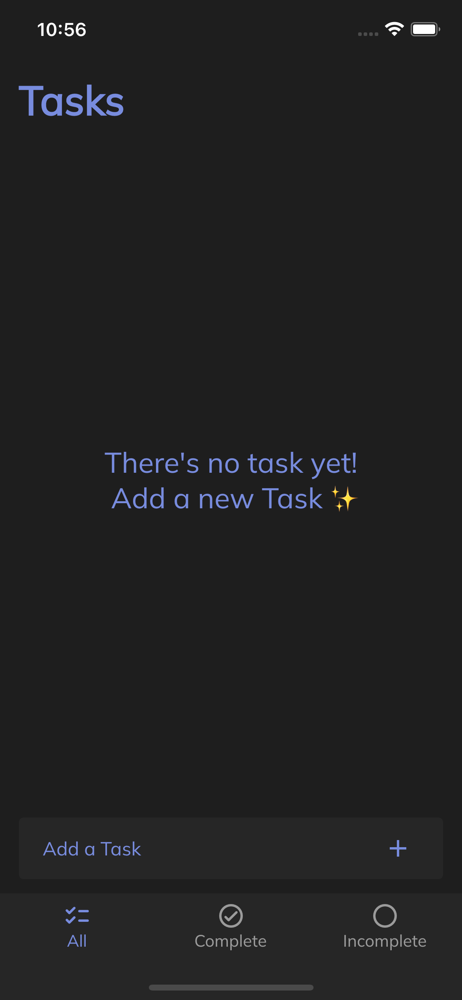
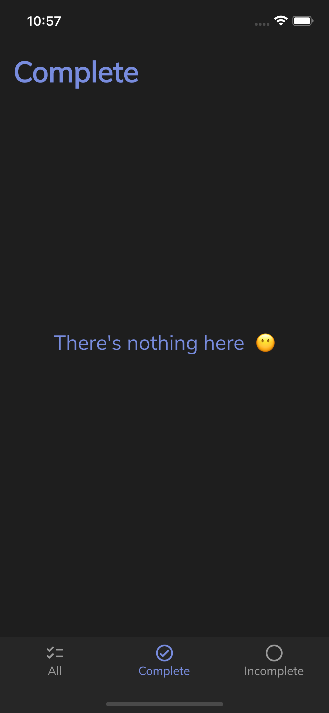
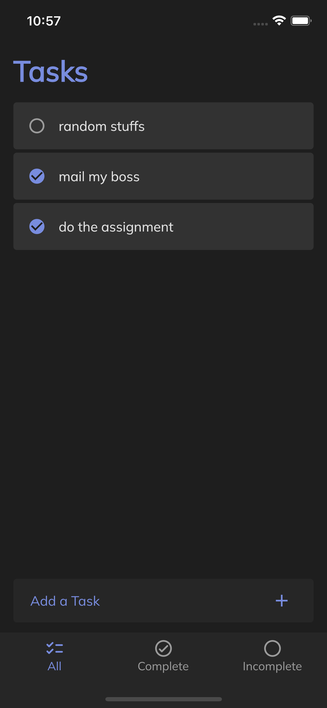
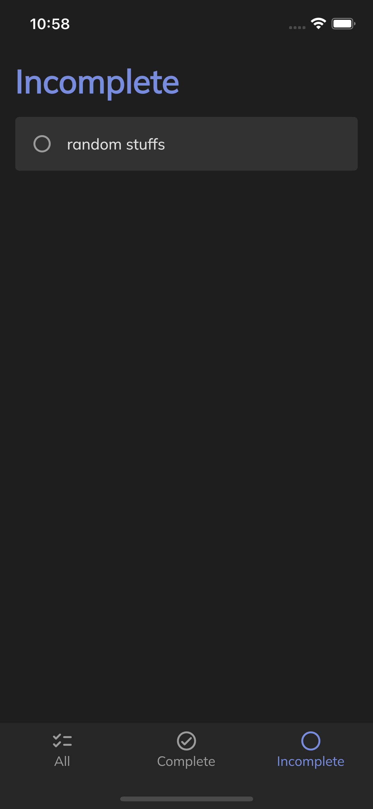
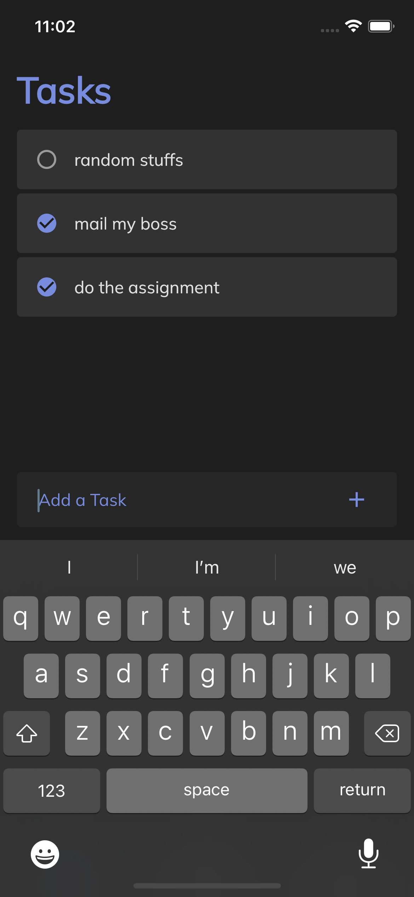

# Todo App 👋

A Task Management App built with Flutter

# Flutter Version

Flutter 3.0.1

# 💻 Requirements

- Any Operating System (ie. MacOS, Linux, Windows)
- Any IDE with Flutter SDK installed (ie. IntelliJ, Android Studio, VSCode etc)
- A little knowledge of Dart and Flutter

# Screenshots

|                                             |                                             |                                             |
|---------------------------------------------|---------------------------------------------|---------------------------------------------|
|  |  |  |
|  |  |  |

# Command

### Install dependencies

```sh
flutter pub get
```

### Run application

```sh
flutter devices
flutter run -d <device id>
```

### Run test and generate coverage report

```sh
flutter test --coverage

# Note: on macOS you need to have lcov installed
# on your system (`brew install lcov`) to use this:
genhtml coverage/lcov.info -o coverage/html

open coverage/html/index.html
```

# Plugins

- [flutter_bloc](https://pub.dev/packages/flutter_bloc)
- [bloc_test](https://pub.dev/packages/bloc_test)
- [hive](https://pub.dev/packages/hive)
- [hive_flutter](https://pub.dev/packages/hive_flutter)
- [get_it](https://pub.dev/packages/get_it)
- [equatable](https://pub.dev/packages/equatable)
- [google_fonts](https://pub.dev/packages/google_fonts)
- [simple_result](https://pub.dev/packages/simple_result)
- [uuid](https://pub.dev/packages/uuid)
- [auto_route](https://pub.dev/packages/auto_route)
- [mockito](https://pub.dev/packages/mockito)

# Features

- Dark Theme
- Create Task
- Update Task
- Local Database using Hive
- Unit-tested

## Author

👤 **Hieu Pham**

* Github: [@Hieu Pham](https://github.com/hieupm2096)
